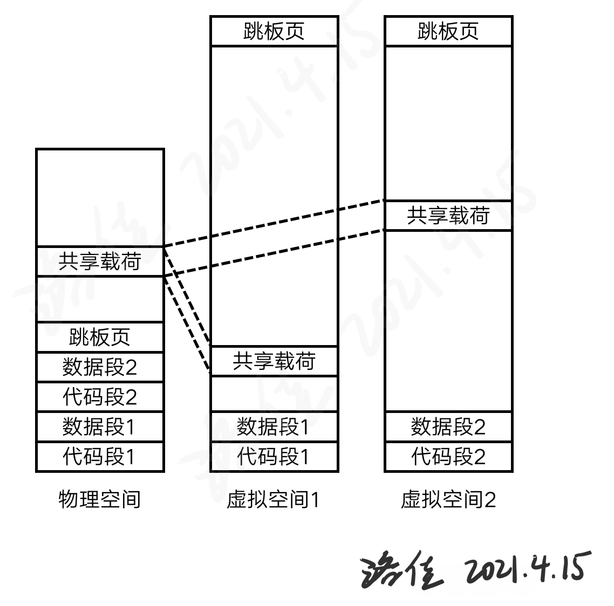
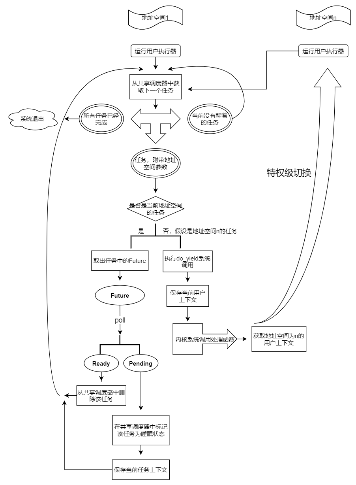
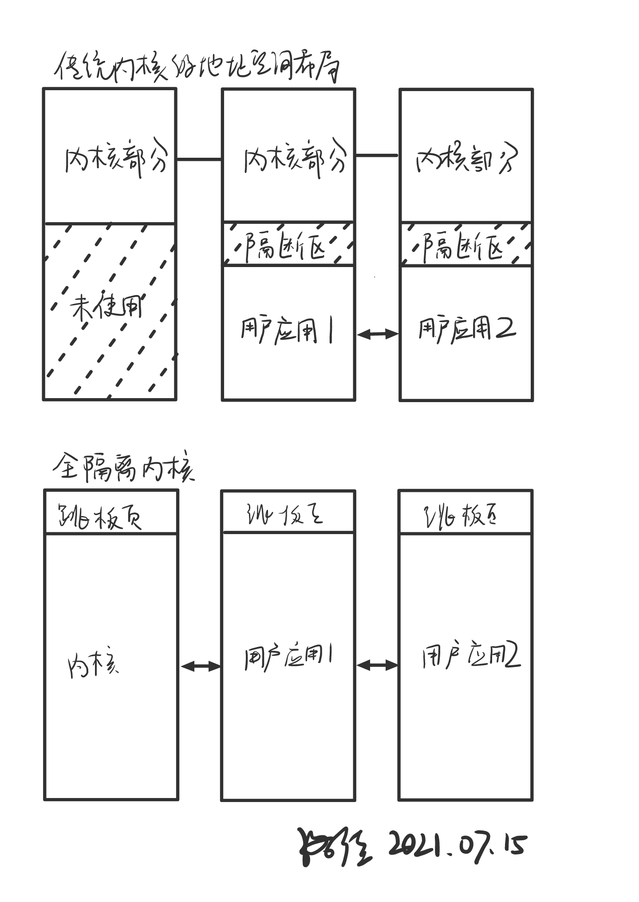

# 飓风内核项目大纲

## 一、目标描述

飓风内核是无相之风战队尝试设计的异步内核简单实现。

针对现代任务时间短、数量较多的特点，我们提出一种新的“异步内核”；它将传统上在用户层提供的“协程”下沉到内核，通过“共享调度器”的方案提高速度，进而在内核态提供一种针对协程的支持机制。我们期望通过这种全新设计的内核，同时满足传统操作系统的易用性，和专有操作系统的高性能特点，进而总体地提高现代应用的运行效率。

本次的任务将使用Rust语言的异步特性，在RISC-V平台上设计一个异步内核。这个内核将统一不同空间的任务调度器，共同作用于线程或协程的调度。通过这种方法，提高操作系统的整体性能。

## 二、比赛题目分析和相关资料调研

赛题要求我们在rCore系统设计的基础上，学习Rust语言的异步特性，在内核层提供协程调度的原语，最终得到一个以内核为核心的用户层异步任务执行环境。

Rust语言具有async/await语法特性，它也是无栈协程的一种实现。使用async/await时，Rust编译器将生成内部的枚举结构体，指示当前任务执行的状态，这个结构体统一以Future接口作为抽象。在Rust中，Future是一个trait，我们能手工实现，也可以交由编译器自己实现。

在引入用户态协程支持时，我们采用任务作为抽象方法。任务是调度的最小单元，它可长可短，协程和线程可以分别看作是短的或长的任务。任务可由内核创建，也可由用户创建。传统的协程实现中，利用系统提供的线程，搭建一个新的用户态运行时，这需要和内核总共有两个调度器实现。为了更高效地调度协程，我们“拍扁”两层，只使用一个调度器，来节约调度算法消耗的时间。借助共享内存的概念，我们提出了“共享调度器”。

于是使用协程调度后，我们可以尽量减少陷入内核的次数。陷入内核的上下文切换时间由多个部分组成，是调度开销较大的耗时部分，通过尽量在用户层切换任务，减少了短任务的切换开销。为了达成这一点，将经常相互使用的一组任务归纳在一起，就构成了“地址空间”的概念。异步内核的调度器设计应当考虑地址空间，将相同空间的任务调度到一起运行，就能减少切换地址空间的频率。因为切换地址空间时间较长，就能节省运行时间。

在这些都完成后，我们可以编写协作式的异步内核。飓风内核就是这样的内核，它能协作式地调度和运行用户任务。作为一个拥有一定功能的内核，它提供了系统调用接口，帮助用户程序的实现步骤。

为了完善异步内核的功能，内核应当编写一系列的异步系统调用和异步功能模块。以本次比赛典型的RISC-V平台为例，可以编写异步的文件系统、SD卡和块设备驱动。包装以上的接口为异步系统调用，进一步得到异步的标准库。在这些步骤都完成后，进行一定的性能测试，说明异步内核的性能提升方向。

## 三、系统框架设计

飓风系统作品包含飓风内核、用户程序和机器接口三个部分。

飓风内核是一个协作式的异步内核。它向上提供的接口分为两类：系统调用接口、共享调度器接口。内核中的异步块设备、异步文件系统提供接口功能，也向共享调度器中添加任务。用户使用接口功能，调用共享调度器，取出用户任务并执行。

执行器是内核和用户都编写的功能模块。飓风系统提供了一种简单的执行器实现方法。它不断从共享调度器中得到任务，并判断是否应当在当前的地址空间中运行。如果是，那么使用Future的poll函数立即运行；如果不是，就调用内核的系统调用，立即执行切换地址空间操作，以便其它地址空间开始运行系统任务。通过共享调度器的“修改任务状态”接口，可以改变当前任务的运行状态，帮助系统取出已就绪的任务执行。

飓风内核本身也采用了较多的异步功能设计。异步virtio块设备驱动是针对QEMU虚拟化平台设计的，它接受内核的外部中断，提交读写请求，通过异步接口返回吞吐的硬盘数据。异步的SD卡驱动操作K210平台的存储接口，它从K210外接的存储卡中读取数据，用于运行内核的应用程序。异步的FAT32文件系统实现了较完整的FAT32异步接口，包括FAT表等存储结构，用于配合SD卡驱动和块设备驱动，完成系统对存储的访问步骤。

以上的异步功能设计也得益于飓风内核本身的异步特性，充分利用了异步内核的特点。

内核的设计采用了“隔离内核”思想。内核程序并非占用高地址，而是使用自己的地址空间，避免影响用户程序的运行。为了在隔离的地址空间中切换，“跳板页”是必要的途径。上下文结构体在这个步骤中也要被访问，它也是内核提供的数据结构。最终，使用这种思想编写内存管理模块，就可以在不同的程序中切换了。

在操作系统之下，RISC-V仍然定义了机器特权层接口。这个接口用于实现被称作“SBI”的机器级环境，它将在不同的平台下支持其上操作系统的运行。飓风项目采用了RustSBI机器环境，它具有较好的兼容性和简便性。

## 四、开发计划

2021年3月：
- 完成能在QEMU上运行的RISC-V内核
- 基本的执行器和调度器
- 完成简单的特权级切换代码

2021年4月：
- 为用户程序分配栈和上下文内存
- 添加调试用系统调用
- 完成分离的共享调度器设计
- 异步任务的不同状态

2021年5月：
- 优化内核项目的编译流程
- 完善共享调度器的接口函数

2021年6月：
- 异步的virtio块设备
- 异步的FAT32文件系统模块
- 支持K210处理器平台

2021年7月：
- 异步的数据同步机构
- 链接和运行用户层应用程序
- 完善virtio块设备等异步驱动

2021年8月：
- 完善K210烧写步骤和编译方法
- 让出、异步读、异步写系统调用
- 内核性能测试样例
- 内存数据库功能样例

## 五、比赛过程中的重要进展

1. 异步块设备驱动及其异步系统调用接口

车春池同学编写了大量异步的系统模块。异步FAT32文件系统支持引导扇区、缓冲区、FAT表等较细致的功能，向上提供异步的API接口。这些接口从初始化文件系统到创建、读取和修改特定的文件，为操作系统加载用户程序提供了较详细的异步支持。FAT32系统模块向下使用了裸的块设备接口，将Rust的异步代码实现融合贯通。异步接口按实现上分为两种类别，一种是接受传回的块设备异步操作，一种是封装较为耗时的FAT遍历操作为异步操作。

  

向下的块设备接口仍然采纳异步接口的模型。完整的Virtio驱动分为三层去实现；本次实现的块设备属于virtio的前端驱动。驱动需要为底层的虚拟硬件提供描述符表、可用环和已用环。使用这些数据结构，软件提交请求到环形队列中，最终从另一个环形队列拿到已得到的请求；硬件接收软件的请求，异步地执行软件的请求指令，从虚拟设备中读取特定的位置。读取过程中，DMA发挥较为重要的作用，它并行地将数据结果填写到内存位置中，不占用处理器的时间。填写的位置、长度都在描述符中给出，描述符以链的形式保存在驱动的内存中。

通过这样的底层结构，向上暴露的就是回调型的异步接口了。`event-listener`是一个非常好的Rust事件环机制库，经过车春池同学修改，它可以用在`no_std`环境下，用于内核开发。当中断发生时，`event-listener`将会解析中断的来源，根据来源来唤醒对应的监听程序；这里的程序将是块设备的async/await驱动程序。

在内核中使用virtio块设备时，直接提交读、写操作为任务，到为虚拟硬件准备的环形队列中。中断发生，此时读取另一环形队列，虚拟硬件应当已经向队列填写了返回内容。这里的内容可能包括读完成或写完成；返回后，直接操作对应的任务，当对应的I/O任务唤醒，对应得到的异步任务步骤也将被设置为完成，这就完成了async/await决定的异步语义功能。

2. 异步的FAT32文件系统

已经完成块设备之后，利用块设备读写的异步接口，可以向上完成异步文件系统。异步的文件系统和同步文件系统写法区别不大，区别在于异步文件系统使用了Rust语言的async/await语法。本次的FAT32实现中，编写了一个块缓存层，来提高文件系统的整体吞吐性能。

FAT32文件系统由DBR分区、FAT分区和数据区组成。FAT32文件系统最重要的操作是遍历节点，由它可以完成文件系统的常用索引操作。遍历节点需要用到树的下降操作，这可以通过索引内部节点表来实现。得到节点后，可以完成遍历、添加新文件等操作。当完成这些操作时，当前的数据结构可能没有多余的空间存储数据，就需要再其它的FAT表内存储数据；否则，最终将弹出磁盘空间不足错误。文件系统常用的读、写和刷新也能通过其余的操作完成。

通过这样的处理后，FAT32文件系统的基本操作就完成了。向上暴露的都将是async/await风格的Rust语言API，和tokio、async-std是类似的。

3. 共享调度器

以往的操作系统内核中，调度器只在内核中运行。内核中执行不同的线程，这些线程中的任务完全由用户的任务给定，而不涉及调度运行的逻辑。如果我们开始设计异步内核，在用户层也要完成任务到任务间的切换过程。这种切换是以知晓下一个任务为前提的，所以用户层也需要运行一个调度器。

我们设计一种合并的共享调度器：这种调度器直接将所使用的代码、任务池资源都共享到用户，由用户运行和内核相同的代码，以此与内核以相同的逻辑处理任务池中的任务，从而从共享的任务池中得到下一个任务。

共享参数调度器的设计要求无论信息为何，用户都不能干扰内核的运行，因此具有一定的安全性。这种设计需要一个工程学上稳定的数据接口，才能在内核、应用更新之后，仍然能够和旧的应用共存调度，完成内核的功能。合并的共享调度器要求将代码、任务池数据都共享给用户，在传统的架构上具有一定的风险，但用户运行的代码永远和内核是同一个版本，有利于生态的建设和推广。

本次设计中，我们采用合并的共享调度器，以探索未来操作系统内核的可能性，希望以此促进指令集架构的研究和探讨，帮助设计更安全的指令集架构。

合并的共享调度器的实现采用页表的多重映射来实现。首先编译一个共享调度器的二进制包，然后将它和内核共同下载到模拟器或者开发板中。它将作为内核的一部分，共同参与内核的运行工作。将共享调度器的地址提供给内核，内核将创建一个多重映射，让共享调度器在多个地址空间下都可见，且同时共享数据段和代码段。这样，每个地址空间都能访问同一个共享调度器了。

4. 异步互斥锁和基于管道的异步通信

协程编程模型提出了协程，也需要协程间有一种传递数据的方式。从经验来看，管道通信是一个比较好的同步方法。Rust语言经过长久的发展，已经有了标准库中mpsc、其它作者的管道通信方式。我们延续这一种做法和API风格，在异步内核的异步标准库中也提供这一种通信方法。

首先，具备类型T的通道通过一个Rust函数建立。这个函数将返回两个具有所有权的结构：发送器和接收器。在我们的设计中，发送器和接收器都可以复制，因此这是一个多生产者、多消费者的通信通道。

发送器和接收器都是具有所有权的Rust结构体，并且它满足Send约束。因此，它可以被送往不同的上下文中执行操作。生产者将推送一个T类型的数据，此时数据将被保存到发送、接收器共享的一块存储区域中。这块区域能存储多个T类型的数据，直到数据满额，因此这是一个有边界的管道。当消费者尝试获取数据时，要么没有数据，要么从共享的存储区域拿出一个数据。通过循环线性队列的方式，可以方便地管理管道缓存中的数据。

与传统的管道不同的是，本次实现的管道取、存操作都是Rust的async函数。

当发送器尝试发送，但缓冲区满时，存操作应当等待缓冲区有效。这个等待操作传统上是陷入内核，但异步内核中，它将为当前的尝试发送事件注册一个监听器。此时，async函数执行到注册监听器，它将中断运行，返回一个Pending到执行器中。当缓冲区重新有效，即有空余的位置能存储数据类型T时，这个监听器将被唤醒，于是async函数可以继续进行，此时必定能找到一个空余区域，存储传入的T类型数据。这部分的等待和注册操作是由`event-listener`库实现的，上文已经提到，我们对社区实现做了一些修改，来适配no_std环境的开发工作。

相似地，当接收器尝试接受时，如果缓冲区空，那么就执行相似的流程，就可以让出到执行器了，这就有较好的加速作用。剩下的问题就是避免管道队列数据的竞争问题了。

我们使用p操作和v操作描述一个生产者-消费者问题。解决这个问题，需要使用一个互斥锁变量。在Rust中，互斥锁常常被设计为一个保护内部数据的结构体，它隐含着这个互斥锁变量。在异步内核中，互斥锁的自旋操作并非等待或进入内核，而是使用类似的监听器注册和提醒过程，和上文的缓冲区空、满操作相似。有了异步的互斥锁，基于管道的异步通信就完成了。

5. 异步语义和内核与用户的执行器

在共享调度器章节的分析中，我们直到异步内核中需要一个合适的调度器，它也能够用户层运行，来完成调度任务的目的。这个调度器返回的内容大概可以分为以下三类：一、执行一个特定的任务；二、应当切换空间，以执行下一空间的任务；三、任务池为空，应当退出程序。

这就是为什么我们需要执行器。调度器因为要设计得便于在地址空间间共享，它执行任务的逻辑就应当独立为一个执行器。这个执行器也由用户设计，它将调用本空间内共享的调度器，根据调度器输出的结果，执行对应的任务。

按照共享调度器返回的内容，执行器将采取特定的操作，来运行调度器提供的任务。

执行器应当根据调度器的输出来处理。如果存在不合规则的用户，不按调度器的输出执行操作，对内核的运行没有较大的影响。如果错误的操作是应当执行任务，却切换了地址空间，那么用户层将得不到继续运行所属任务的时间，因此这个操作将导致异步程序无法运行，容易被用户发现和修复。

另外，由于任务池中包含任务的元数据，只有当前地址空间的任务，允许在当前地址空间运行。因为任务的元数据中包含它的内容，只有当前地址空间的执行器可以解释，所以夹杂不同空间的调度器，不会造成执行器误认任务的情况。

在真实的应用开发中，用户不会选择为每个程序都编写一个执行器。因此，编程语言将提供简单的执行器，与用户的程序共同编译，得到完整的异步程序。飓风系统的项目提供了一个可供参考的用户标准库的实现，它就包含一个可用于执行Rust的async/await程序的运行时，可以直接运行Future，从而运行Rust的异步程序。

6. 内核的隔离设计

传统内核的地址空间有时分为上下两部分：下部分由各个应用轮流占有，而上部分保留于内核使用。这种设计在运行用户程序时，限制用户访问上半部分内存，来避免内核数据本身受到破坏。这部分数据仍然保存在地址空间中，只是通过权限设置，让攻击者无法直接访问。

攻击者确实无法直接访问，于是侧信道攻击出现了。

访问这部分地址的数据，即使访问失败，它也被用于计算其它访问目标的地址，这个目标将进入处理核的高速缓存中。于是攻击者通过时间差，探测其它访问目标的访问时间，计算出最快的访问地址，从而倒推出禁止访问地址的数据值。这类攻击原理中最出名的是Meltdown攻击，它可以以数十千字节每秒的速度套出内核的机密信息。

我们可以采用一种比较新的地址空间设计，rCore-Tutorial内核就采用了类似的设计。在这种设计中，所有的地址全部交由应用使用，内核本身不保留地址。这种设计将无法访问的内核数据挡在地址空间切换之后，而不是留在高地址区域。因为它除了少量需的跳板页，完全不与内核本身共享内存空间，我们可以称之为“隔离内核”。

全隔离内核的用户空间中并非仍然存在不可访问的内核数据，而是完全挡在地址空间之外。除此之外，它为应用提供更多的地址位置，允许运行更大的应用程序，或加载更多的动态链接库，以便于提高用户程序设计的灵活性。本次的飓风内核我们就采用了隔离内核的设计。

注意的是我们通过隔离机制，可以减少通过其它通道获得内核数据的途径，并不能防止此类攻击命中用户程序的其它部分。针对此类攻击，重新设计处理核的电路仍然是最彻底的防御方法。

7. 详细的内核开发文档

编写本项目的所有文档整理在文档文件夹中（[链接](https://github.com/HUST-OS/tornado-os/tree/introduction/doc)），它的所有插图整理在附件文件夹中（[链接](https://github.com/HUST-OS/tornado-os/tree/introduction/assets)）。这些详细的内核开发文档针对飓风内核的目前实现，它能为内核设计提供帮助和参考，也能帮助后续的内核开发者了解项目的大致情况。

团队成员在编写内核时，产生了一些灵感，总结了一些部分的内核设计经验。这些文档公布在“无相之风团队官方网站”上（[链接](https://qf.rs)）。涉及异步内核的原始设计、virtio驱动的编写思路，以及一部分可能的新执行器设计等等。这些文档对战队成员的交流发挥了较大的帮助。

## 六、系统测试情况

## 七、遇到的主要问题和解决方法

1. 涉及页表的代码调试难度较大

团队成员共同编写了“RISC-V二进制开发在线工具”（[链接](https://rvgj.qf.rs/)），帮助调试页表代码。在能够使用调试器的前提下，在线工具能整合调试器的输出结果，为开发者列出页表项的指向内容，帮助开发者更快地完成页表调试工作。

2. 

## 八、分工和协作

赛队两位队员蒋周奇、车春池。蒋周奇同学主要负责异步内核概念、文档编写以及早期的内核代码设计，负责做技术报告。车春池同学负责大部分的异步生态代码实现，负责内核测试，录制内核功能的演示视频，以及做与技术报告。队员共同参与技术报告会，共同协作负责文档、演示文稿的编写工作。

## 九、提交仓库目录和文件描述

|目录名称|介绍|
|---|---|
|tornado-kernel|飓风内核实现|
|shared-scheduler|共享调度器实现|
|tornado-user|用户态代码实现|
|async-virtio-driver|异步virtio块设备驱动|
|async-fat32|异步fat32文件系统|
|async-mutex|异步互斥锁|
|async-sd|异步sd卡驱动|
|event|支持`no_std`的事件机制库|
|rv-lock|RISC-V指令集关中断的锁|

## 十、比赛收获
